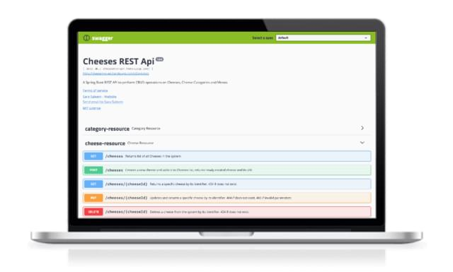

# Cheeses - A REST API

## Contents

- [Features](#features)
- [Built with](#built-with)
- [Live Version](#live-version)

## Features

### Resources and Operations
This REST API handles three types of resources.

Resource       |Attributes | Create   | Read    | Update  | Delete
---            |--- | -----    | -----   | ------- |-------
Cheese         | Name, Description, Rating, Cheese Category | &#10004; | &#10004;| &#10004;| &#10004;
Cheese Category| Name| &#10004; | &#10004;| &#10008;| &#10008;
Menu           | Name, Set\<Cheese>| &#10004; | &#10004;| &#10004;| &#10008;

### Model Validation
Attributes in all the entities are annotated using Java Validation API annotations to provide automatic validation and error feedback.

### Data Transfer Objects and ModelMapper
- For cheese entity, a data transfer object `CheeseDto` is used to send and receive relevant attributes efficiently to/from the API consumer. Upon receiving `CheeseDto`, `modelMapper.map()` method is used to convert data transfer object to cheese entity.
- For category entity, `@JsonIgnore` is used to exclude serialization of list of cheeses that have the same category when sending category data.

### Data Access Objects(DAO)
- Spring Data repository abstraction significantly reduces the amount of boilerplate code required to implement data access layers for various persistence stores. Spring Data `CrudRepository` provides sophisticated CRUD functionality for the entity class that is being managed. DAO's for cheese, cheese category and menu are created through `CrudRepository` interface. 
- Spring Data JPA `@Query` annotation is used to declare custom queries for entities managed by DAO.

### Resource Relationship Handling
- **Cheese Category-Cheese(many to one)**: Multiple cheeses can have same category. `@OneToMany` and `@ManyToOne` annotations from JPA are used to define a many-to-one relationship between the join tables.
- **Cheese-Menu(many to many)**: A menu can have multiple cheeses and a cheese. can belong to multiple menus. `@ManyToMany` annotation from JPA is used to define a many-to-many relationship between the join tables.
    - _**Removing entities with bidirectional association**_: 
    Using `@PreRemove` entity lifecycle hook, a callback is provided to remove all the menu associations for a particular cheese  . Callback[1](#myfootnote1) annotated with `@PreRemove` is executed before the entity manager's remove operation is actually executed or cascaded 
    
    <a name="myfootnote1">1</a>: Callback methods are user defined methods that are attached to entity lifecycle events through annotations and are invoked automatically by JPA when these events occur.

### Exception Handling
- add about custom exceptions

### Visual Documentation
For documentation OpenAPI/Swagger 2 specification annotations are used. Springfox implementation of Swagger 2, along with Swagger UI libraries are used to generate interactive documentation.

## Built with

- [Spring Boot](https://spring.io/projects/spring-boot) - An opinionated view of the Spring platform with 'starter' dependencies to simplify build configuration and create stand-alone Spring applications
- validation ?
- [Spring Initializr](https://start.spring.io/) - A web based tool to quickly generate Spring Boot projects.
- [Java Persistence API](https://docs.oracle.com/javaee/6/tutorial/doc/bnbpz.html) - Java Persistence API is a source to store business entities as relational entities. It shows how to define a Plain Old Java Object (POJO) as an entity and how to manage entities with relations.
- [Java Validation API Annotations](https://docs.oracle.com/javaee/6/tutorial/doc/gircz.html) - The Bean Validation model is supported by constraints in the form of annotations placed on a field, method, or class of a JavaBeans component, such as a managed bean.
- [Spring Boot Data JPA Starter](https://mvnrepository.com/artifact/org.springframework.boot/spring-boot-starter-data-jpa) - Starter for using Spring Data JPA with Hibernate
- [Hibernate ORM](https://hibernate.org/orm/) - An object-relational mapping tool for the Java programming language. Hibernate is an implementation of the Java Persistence API (JPA) specification. It provides a framework for mapping an object-oriented domain model to a relational database.                            
- [ModelMapper](http://modelmapper.org/) - An object mapping library that uses conventions to determine how one object model maps to another.
- [SpringFox](https://springfox.github.io/springfox/) - A project that aims at creating automated JSON API documentation for API's built with Spring.
- [Swagger UI](https://swagger.io/tools/swagger-ui/) - An open source tool for visual documentation of REST APIs. It allows anyone to visualize and interact with the API’s resources without having any of the implementation logic in place.

## Live Version

The live version of this API can be explored at either of the following links.

- [Heroku Deployment](https://cheesemvc-api.herokuapp.com/swagger-ui.html#)
- [AWS Deployment](http://cheese-api-lb-1176575407.us-east-1.elb.amazonaws.com/swagger-ui.html#)
